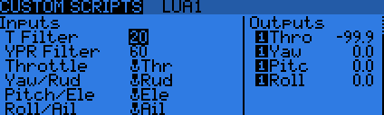
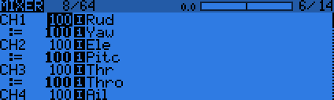
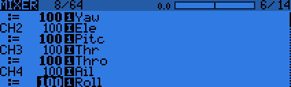

# Radio Smoothing
A LUA mixer script for OpenTX that creates new four inputs that are smoothed based off a custom filter.

The custom filter uses a bit of calculus with derivatives to smooth the sticks.
This is diffrent compared to how one will tune the D for PID's as our number is a percent range.
As it uses derivatives this means that the values will change depending on how fast you move the sticks around.
This will allow for quick rolls but still have juicy feel around minor changes in stick movement.

## Installation
This is a LUA script for the OpenTX software.
This script is designed for the mixer section part of the model.

You install the `smooth.lua` LUA file under the SD contents in the `SCRIPTS/MIXER` folder.
Under the `Custom Scripts` tab you can create an entry for the LUA file smooth.
You assign your sticks as inputs (**Its recommended to use the *HARDWARE* inputs and not the virtual inputs**) and it will create new virtual inputs with smooth values as the output.

The new virtual inputs are then assigned under the mixer like you would normally do.
Though do to the values being virtual we recommend to add the values under normal value with the multiplexer set to replace.
If anything happens the mixer will use the hardware values just as you are used to.

# Q's and A's
- What do the filter values represent?
> There are two constants that you can change one for the throttle and one that combines yaw, pitch, and roll.
> They are percentage values based on the strength of the filter, the higher the number the smoother the sticks will feel but more delay.

- Can I still do fast rolls and flips?
> Yes this is not just smoothing the values but takes in account on how fast you move the sticks.

- What happens if the script crashes or runs out of memory?
> OpenTX will disable the virtual input created by the script.
> If you following the mapping recommended by us if this does happen the hardware sticks will be used instead.

- How do I disable the filter with out updating the mixer.
> You can set the filter value(s) to 0 and it will just pass through the values.
> If you don't want your throttle to be smoothed you can set that to 0 and only smooth the other values.

## License
This project is current under `No License`.
This will change at a further date as time goes on and people show interested in this project.
Currently you are allowed to download the code and install it on your radio.
You may tweak the code for personal use and only for your own education value.
